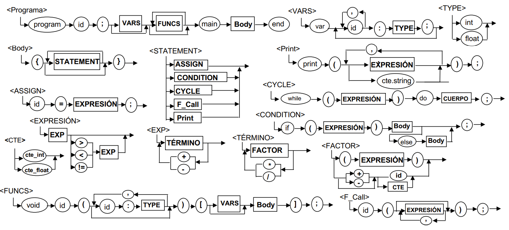

# Baby Duck Compiler
This repository contains the implementation of the compiler for Baby Duck, a classic procedural micro-language.
The project covers the complete compilation process: lexical analysis, syntax analysis, semantic validation, intermediate code generation, and a virtual machine for execution.

The compiler is developed in Python using PLY (Python Lex-Yacc) for the scanner and parser construction.

## About the project
This project was developed as part of the course TC3002B - Advanced Application Development for Computer Science, within the Compilers Module.

The main stages of the compiler include:
- **Lexical analysis**: Using regular expressions to identify the tokens of the Baby Duck language.
- **Syntax analysis**: Based on a formal grammar derived from the language diagram.
- **Semantic analysis**: Type checking, variable declaration validation, and control flow checks.
- **Intermediate code generation**: Translating Baby Duck programs into an intermediate representation.
- **Virtual Machine (VM)**: Custom VM capable of interpreting and executing the intermediate code.

## Technologies
- Python 3
- PLY (Python Lex-Yacc)

## License
This project is licensed under the MIT License.

